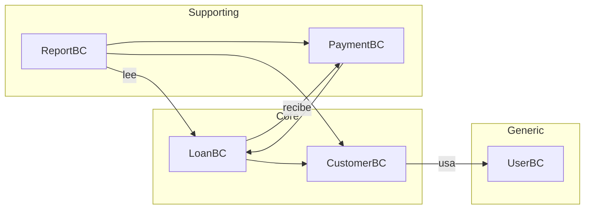

# Bounded Contexts del Proyecto

## Clasificación General

| Bounded Context | Tipo | Descripción |
|----------------|------|-------------|
| **CustomerBC** | Core Domain | Dominio principal del negocio |
| **LoanBC** | Core Domain | Dominio principal del negocio |
| **PaymentBC** | Supporting Domain | Apoya al core domain |
| **UserBC** | Generic Subdomain | Funcionalidad técnica |
| **ReportBC** | Supporting Domain | Generación de informes |

---

## Detalle por Contexto

### 1. CustomerBC (Core Domain)
```
Propósito: Gestión de clientes del sistema de préstamos
Responsabilidades:
  - Registro y modificación de clientes
  - Cifrado de datos sensibles (DNI, nombres, dirección)
  - Validación de identidad
  - Historial de clientes
Relaciones: LoanBC (cliente tiene préstamos)
```

### 2. LoanBC (Core Domain)
```
Propósito: Gestión de préstamos y capital
Responsabilidades:
  - Creación de préstamos
  - Cálculo de intereses (mensual)
  - Estados del préstamo (ACTIVE, PAID, DEFAULTED)
  - Seguimiento de deuda
Relaciones: CustomerBC, PaymentBC
```

### 3. PaymentBC (Supporting Domain)
```
Propósito: Procesamiento de pagos
Responsabilidades:
  - Registro de pagos
  - Aplicación de pagos a préstamos
  - Estados de pago (PENDING, VALIDATED, APPLIED)
Relaciones: LoanBC (pagos afectan préstamos)
```

### 4. UserBC (Generic Subdomain)
```
Propósito: Autenticación y autorización
Responsabilidades:
  - Login/logout
  - Tokens JWT (Sanctum)
  - Sesión de usuarios
Relaciones: Todos los contextos
```

### 5. ReportBC (Supporting Domain)
```
Propósito: Generación de reportes
Responsabilidades:
  - Proyectado vs Real
  - Disponibilidad de cobro
  - Rentabilidad por cliente
Relaciones: LoanBC, PaymentBC, CustomerBC
```

---

## Mapa de Contexto

